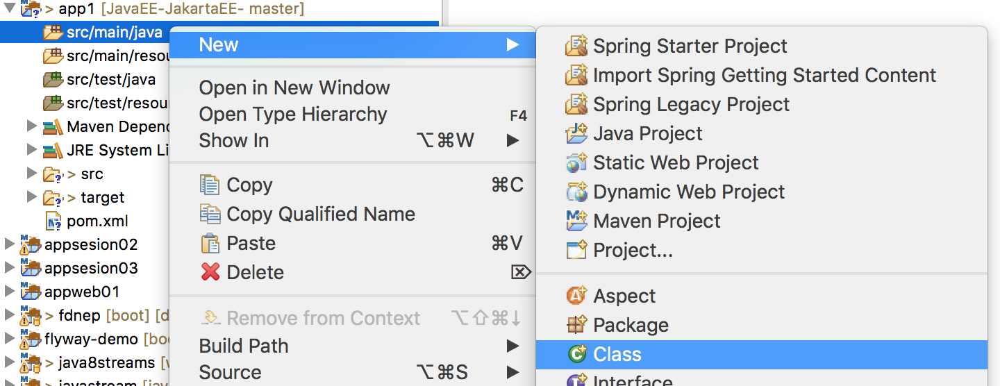
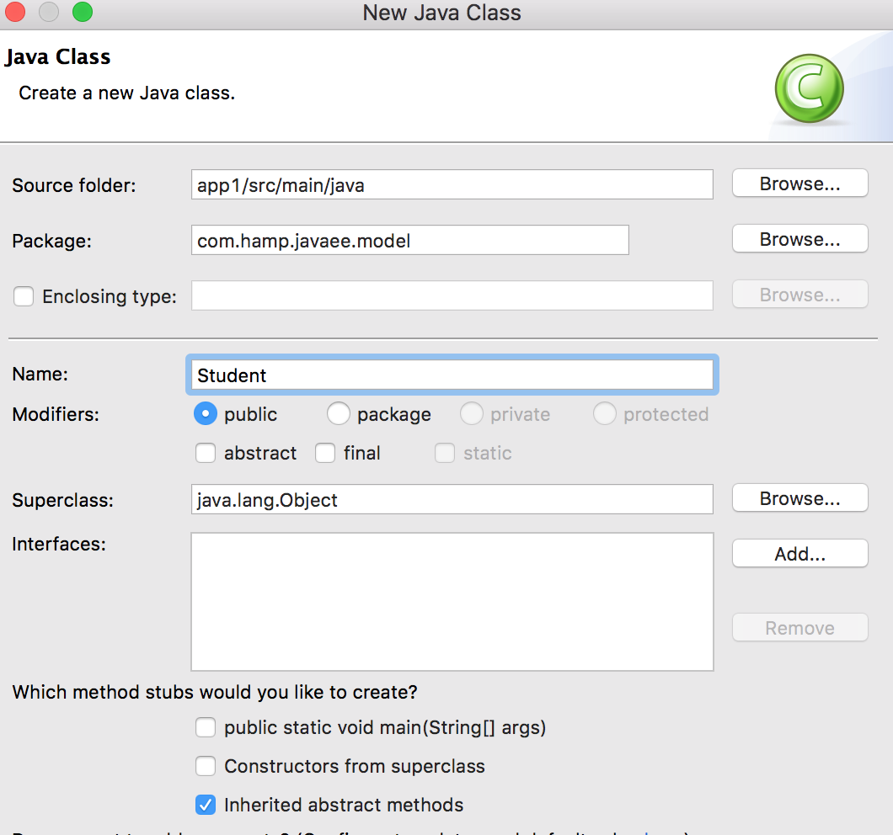
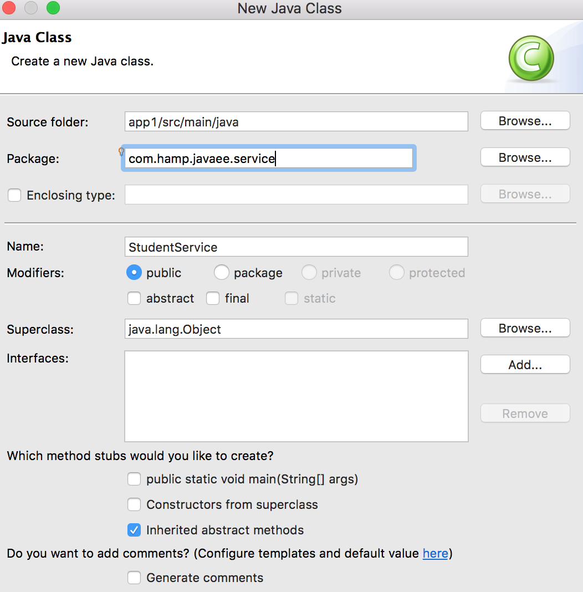
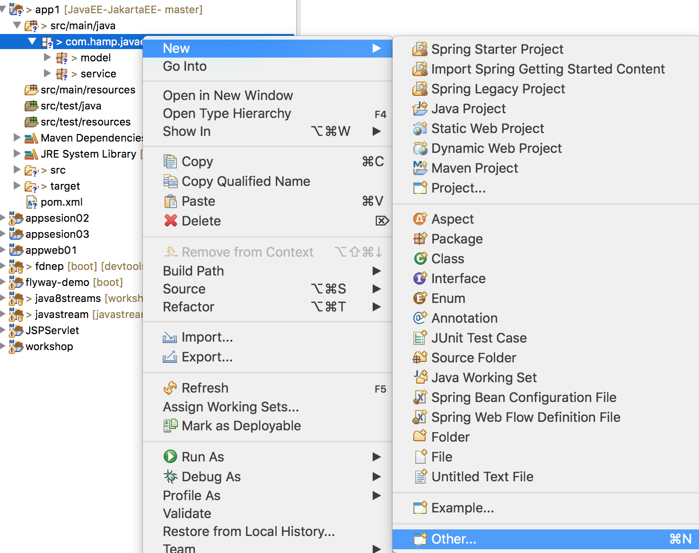
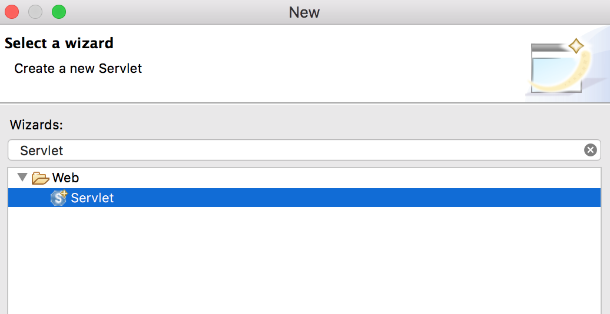
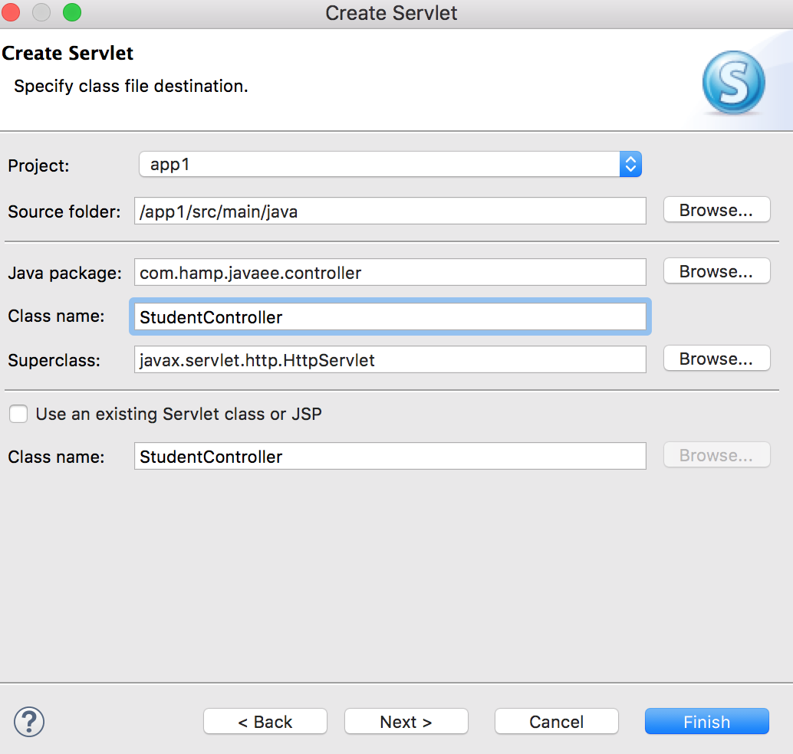

## <a name="content-id"></a> Contenido
1. [Introducción](#intro-id)
2. [Java EE 8](#java-id)
3. [Requisitos Software](#req-id)
4. [Patrones de diseño](#pat-id)
5. [Proyecto](#pro-id)
6. [Servlet-JavaServer Pages(JSP)](#sp-id)
7. [JavaServer Faces(JSF)](#jsf-id)
8. [Context Dependency Injection (CDI)](#jsf-id)
9. [Configuración de DataSource en Wildfly](#jsf-id)
10. [Java Persistence API (JPA)](#jpa-id)

---
## <a name="intro-id"></a>Introducción
En 2017 Oracle decidió dejar de controlar el desarrollo de Java EE y empezarían por buscar una organización open source a la que pasar la batuta. Esa organización terminó siendo la [Eclipse Foundation](https://www.eclipse.org/) , la misma comunidad detrás de la plataforma Eclipse que consiste en el IDE y el ambiente de desarrollo.

Oracle dijo que la razón de esto era mejorar el proceso de desarrollo de Java EE que a pesar de ya desarrollarse de forma abierta con la ayuda de la comunidad, debería tener un proceso más flexible y abierto. Pero flexible es algo que Oracle no es a la hora de usar la marca Java, y por ello Java EE ha tenido que cambiar de nombre a Jakarta EE.

El nuevo nombre fue elegido por casi 7.000 personas que votaron en una encuesta hecha a la comunidad de Eclipse. La decisión estaba entre usar "Jakarta EE" o "Enterprise Profile" y la primera opción [ ganó con el 64% de los votos.](https://mmilinkov.wordpress.com/2018/02/26/and-the-name-is/)

Varias partes del proyecto han recibido nuevos nombres. Ahora que Java EE es Jakarta EE, Glassfish pasa a ser Eclipse Glassfish, Java Community Process (JCP) pasa a llamarse Eclipse EE.next Working Group (EE.next), y Oracle development management ahora es Eclipse Enterprise for Java (EE4J) y Project Management Committee (PMC).

Java EE (Java Platform, Enterprise Edition) es una plataforma de programación para desarrollar y ejecutar software empresarial usando el lenguaje de programación Java. Java EE también es considerado como un estándar, y aunque Oracle continuará ofreciendo soporte a las implementaciones actuales de Java EE y participando de alguna forma en las futuras tecnologías que se desarrollen, el control lo tiene ahora la Fundación Eclipse y la comunidad open source.

#### [Ir a Contenido](#content-id)
---
## <a name="java-id"></a> Java EE 8
Java EE 8 admite muchas nuevas especificaciones de tecnología Java, que incluyen:

 


* **Bean Validation 2.0**
Esta es una especificación de java el cual nos permita expresar restricciones en los objetos usando anotaciones, además de crear nuestras propias restricciones. También proporciona las APIs para validar objetos así como su representación, y también valida los parámetros recibidos y los valores devueltos de los métodos y los constructores.

* **CDI 2.0**
Inyección de Contexto y Dependencia (Contexts and Dependency Injection) para  Java EE define un potente conjunto de servicios complementarios que nos ayudarán a mejorar la estructura del código de una aplicación. 

* **JAX-RS 2.1**
Eventos enviados por Servidor (del inglés Server-Sent Events (SSE)) es una tecnología nueva definida como parte de HTML 5 que establece recomendaciones para que un cliente obtenga actualizaciones desde el servidor HTTP de manera automática. Es comúnmente empleado para transmisiones de data streaming de un sentido, en el que el servidor actualiza su información y le notifica al cliente periódicamente, o cada vez que sucede un evento.

* **JAX-RS 2.0** 
Presenta APIS  de procesamiento asíncrono tanto para cliente como para servidor. 

* **JSF 2.3**
La tecnología JSF simplica la construcciones de interfaces para aplicaciones JavaServer. Los desarrolladores pueden construir rápidamente aplicaciones web para: ensamblar componentes UI reutilizables en una página, conectar estos componentes a una fuente de datos y conectar eventos en el cliente a los eventos del servidor. Ahora tenemos una característica llamada invocación Ajax que permite invocar métodos de un Managed Bean (CDI) directamente desde Ajax, permitiendo responder usando el estándar JSON.  Esta versión también permite validaciones en varios campos, @Inject FacesContext, rendimiento optimizado en EL, y aclaraciones Ajax cruzadas. Además, es compatible como MVC 1.0.

* **JSON-P 1.1**
Esta versión ofrece   JSON Patch, JSON Merge y JSON Pointer. También usa los streams y lambdas de Java SE 8.

* **Servlet 4.0**
Una de las características más esperadas para Java EE8 es HTTP/2.0 y Server Push, el cual  trae un aumento de rendimiento para las aplicaciones JSF. Solo basta con migrar a un servidor que sea compatible con Java EE 8.

* **JSON-B 1.0**
Es una capa de unión estándar para convertir objetos Java hacia y desde mensajes JSON. Define un algoritmo de mapeo por omisión para convertir clases Java existentes a JSON, y también permite al desarrolladores personalizar el proceso de mapeo a traves de anotaciones Java. Esto ya lo vimos en un post anterior: Un vistazo a JSON-B de Java EE8

* **Security API**
Este API es muy usado en el moderno paradigma de aplicaciones en la nube/PaaS. Promueve portabilidad en aplicaciones autocontenidas para todos los servidores Java EE, y promueve el uso de modernos conceptos de programación tales como lenguajes de expresión, e inyección de depedencia y contexto.

Video 
[](https://youtu.be/FCsqchsK9UA "Java EE8")

#### [Ir a Contenido](#content-id)
---

## <a name="req-id"></a>Requisitos de Software

En el siguiente enlace encontraras el software que debes instalar y configurar.

[Guia](https://drive.google.com/open?id=1QYuFhqT_IKzmI5Mu5cR4fPQRWYvm12sQ)

#### [Ir a Contenido](#content-id)
---

## <a name="pat-id"></a>Patrones de diseño
Una fase muy importante en el ciclo de vida de un proyecto es el Diseño del Software. Se trata de una etapa fundamental y en muchas ocasiones la más importante en el desarrollo de Software. Es el momento en que los profesionales tienen que aportar sus conocimientos, experiencia y creatividad para llegar a una solución que cumpla con los requisitos funcionales y no funcionales 
establecidos en la fase de la toma de requisitos.

Para ello debemos conocer y aplicar los patrones de diseño. Estos son soluciones (ya probadas y documentadas) a problemas de desarrollo conocidos.

En la implementación del la aplicación utilizaremos 4 patrones:

* [Patrón MVC (Model View Controller).](https://www.tutorialspoint.com/design_pattern/mvc_pattern.htm) 
* [Patrón DAO (Data Access Object).](https://www.tutorialspoint.com/design_pattern/data_access_object_pattern.htm)
* [Patrón TO (Transfer Object).](https://www.tutorialspoint.com/design_pattern/transfer_object_pattern.htm) 
* [Patrón DI (Dependency Injection).](https://es.wikipedia.org/wiki/Inyecci%C3%B3n_de_dependencias) 

Los invito a revisar el siguiente enlace de Martin Fowler para complementar esta sección.

* [Software Design](https://www.martinfowler.com/design.html). 

#### [Ir a Contenido](#content-id)
---
## <a name="pro-id"></a>Proyecto
Debes ingresar a tu IDE para crear un proyecto maven.

* Ir a `File` > `New` > `Maven Project`.

    

* Crearemos un proyecto simple, marca la opción `Create  a simple project(skip archetype selection)`.

    

* Ingresamos los datos de `Group Id`, `Artifact Id` y seleccionamos como `Packaging` **war**  .

    

* Luego agregamos el siguiente bloque de codigo en el archivo `pom.xml`, para actualizar a Java 8 nuestro proyecto. No olvide guardar los cambios.

    ```xml
    <build>
		<plugins>
			<plugin>
				<groupId>org.apache.maven.plugins</groupId>
				<artifactId>maven-compiler-plugin</artifactId>
				<version>3.6.1</version>
				<configuration>
					<source>1.8</source>
					<target>1.8</target>
				</configuration>
			</plugin>
		</plugins>
	</build>
    ```
* El siguiente mensaje de error se genera porque necesitamos generar el archivo `web.xml`.

    

    Para generar este archivo debes dar click derecho en el proyecto y seleccionar `Generate Deployment Descriptor Sub`.

    
  
    Debemos actualizar el codigo del archivo `web.xml` por el siguiente.

    ```xml
    <?xml version="1.0" encoding="UTF-8"?>
    <web-app version="3.1" xmlns="http://xmlns.jcp.org/xml/ns/javaee"
        xmlns:xsi="http://www.w3.org/2001/XMLSchema-instance"
        xsi:schemaLocation="http://xmlns.jcp.org/xml/ns/javaee http://xmlns.jcp.org/xml/ns/javaee/web-app_3_1.xsd">

        <display-name>app1</display-name>
        <welcome-file-list>
            <welcome-file>index.jsp</welcome-file>
        </welcome-file-list>
    </web-app>
    ```

    Luego para actualizar el proyecto debes dar nuevamente click derecho y elegir `Maven` > `Update Project`.

    

* Debemos agregar las siguientes dependencias en el archivo `pom.xml`. 

    ```xml
    <dependencies>
		<dependency>
			<groupId>javax</groupId>
			<artifactId>javaee-api</artifactId>
			<version>8.0</version>
			<scope>provided</scope>
		</dependency>

		<dependency>
			<groupId>javax.servlet</groupId>
			<artifactId>javax.servlet-api</artifactId>
			<version>4.0.1</version>
			<scope>provided</scope>
		</dependency>
	</dependencies>
    ```

#### [Ir a Contenido](#content-id)
---
## <a name="sp-id"></a>Servlet- JavaServer Pages (JSP)
Antes de iniciar con la creación de un Servlet y JSP en el proyecto creado en la sección anterior debemos dar una definición de cada uno de estos componentes.

Video 
[](https://www.youtube.com/watch?v=cWCVSNqjy5Q "ServletJSP")

* Servlet 

    Servlet API es un componente fundamental de la parte principal del servidor Java y parte de las tecnologías Java EE, como JAX-RS para servicios web, JSF (JavaServer Faces) y JSP (JavaServer Pages). Dentro de sus caracteristicas incluyen filtros, seguridad web y características para manejar solicitudes y respuestas HTTP.

    En el siguiente enlace podras encontrar videos sobre las nuevas caracteristicas de [Servlet 4.0 ](https://www.ibm.com/developerworks/library/j-javaee8-servlet4/index.html).

* JavaServer Pages (JSP)

    Los JavaServer Pages son páginas que permiten vincular parte de lógica java, si en los servlet tenemos una clase y metemos código html aquí es lo contrario, estas permiten crear contenido web dinámico que luego se procesa traduciendo el jsp a un servlet que es compilado y ejecutado.

    Junto con JSP, se suele trabajar también con  [JSTL (JavaServer Pages Standard Tag Library)](https://www.tutorialspoint.com/jsp/jsp_standard_tag_library.htm)., una de las muchas librerías de etiquetas que podemos utilizar, que sirve para extenderla.

     En el siguiente enlace podras encontrar mas información sobre [JSP ](https://www.ibm.com/developerworks/java/tutorials/j-introjsp/j-introjsp.html).

Bueno ahora si manos a la obra, Cabe indicar que este ejercicio sera implementado utilizando el Patrón MVC.
> * Model: Un Java Class que tendra la información de `Student`.
> * Controller:  Un Servlet `StudentController` para la gestión de las peticiones y respuestas mediante el protocolo HTTP.
> * Vista:  Un JSP que contendra el HTML, CSS y el uso de JSTL para extender su funcionalidad.

y Patrón TO para separar la logica de negocio en un Java Class.
> * Service: Un Java Class `StudentService` donde se implemente la logica de negocio.

A continuación los pasos a seguir.

* Creamos el Java Class `Student`.

    

    

    ```java
        package com.hamp.javaee.model;

        public class Student {
            
            private int id;
            private String firstName;
            private String lastName;
            
            // constructors, getters and setters  here

        }

     ```

* Creamos el Java Class `StudentService`

    

    

    ```java
        package com.hamp.javaee.service;

        import java.util.Optional;

        import com.hamp.javaee.model.Student;

        public class StudentService {

            public Optional<Student> getStudent(int id) {
                switch (id) {
                case 1:
                    return Optional.of(new Student(1, "Henry", "Mendoza Puerta"));
                case 2:
                    return Optional.of(new Student(2, "Alexandra", "Melendez Leon"));
                case 3:
                    return Optional.of(new Student(3, "Max", "Sanchez Rodriguez"));
                default:
                    return Optional.empty();
                }
            }

        }

     ```

* Creamos el Servlet `StudentController`
    
    

    

    

    ```java
        package com.hamp.javaee.controller;

        import java.io.IOException;

        import javax.servlet.RequestDispatcher;
        import javax.servlet.ServletException;
        import javax.servlet.annotation.WebServlet;
        import javax.servlet.http.HttpServlet;
        import javax.servlet.http.HttpServletRequest;
        import javax.servlet.http.HttpServletResponse;

        import com.hamp.javaee.service.StudentService;


        @WebServlet("/StudentController")
        public class StudentController extends HttpServlet {
            private static final long serialVersionUID = 1L;
            private final StudentService studentService = new StudentService();


            public StudentController() {
                super();
                // TODO Auto-generated constructor stub
            }

            
            protected void doGet(HttpServletRequest request, HttpServletResponse response)
                    throws ServletException, IOException {
                // TODO Auto-generated method stub
                response.getWriter().append("Served at: ").append(request.getContextPath());
            }

            
            protected void doPost(HttpServletRequest request, HttpServletResponse response)
                    throws ServletException, IOException {
                // TODO Auto-generated method stub
                String studentID = request.getParameter("id");
                if (studentID != null) {
                    int id = Integer.parseInt(studentID);
                    studentService.getStudent(id).ifPresent(s -> request.setAttribute("studentRecord", s));
                }

                RequestDispatcher dispatcher = request.getRequestDispatcher("/result.jsp");
                dispatcher.forward(request, response);
            }

        }

     ```
* Creamos las vistas `index.jsp` y `result.jsp`

    

    

    ```jsp
        <%@ page contentType="text/html;charset=UTF-8" language="java"%>
        <html>
        <head>
        <title>Servlet-JSP</title>
        </head>
        <body>

            <form name="bmiForm" action="StudentController" method="POST">

                <table>
                    <tr>
                        <td>Id :</td>
                        <td><input type="text" name="id" /></td>
                    </tr>

                    <input type="submit" value="Submit" name="Send" />

                </table>

            </form>

        </body>
        </html>

     ```


    

    ```jsp
        <%@ page language="java" contentType="text/html; charset=ISO-8859-1"
        pageEncoding="ISO-8859-1"%>

        <%@ page import="com.hamp.javaee.model.Student"%>
        <!DOCTYPE html PUBLIC "-//W3C//DTD HTML 4.01 Transitional//EN" "http://www.w3.org/TR/html4/loose.dtd">
        <html>
        <head>
        <meta http-equiv="Content-Type" content="text/html; charset=ISO-8859-1">
        <title>Student Record</title>
        </head>
        <body>
            <%
                if (request.getAttribute("studentRecord") != null) {
                    Student student = (Student) request.getAttribute("studentRecord");
            %>

            <h1>Student Record</h1>
            <div>
                ID:
                <%=student.getId()%></div>
            <div>
                First Name:
                <%=student.getFirstName()%></div>
            <div>
                Last Name:
                <%=student.getLastName()%></div>

            <%
                } else {
            %>
            <h1>No student record found.</h1>
            <%
                }
            %>
        </body>
        </html>

     ```

#### [Ir a Contenido](#content-id)
---
## <a name="jsf-id"></a>Java Server Faces (JSF)
#### [Ir a Contenido](#content-id)
---
## <a name="jpa-id"></a>JPA
#### [Ir a Contenido](#content-id)
---
## CDI


