## <a name="content-id"></a> Contenido
1. [Introducción](#intro-id)
2. [Java EE 8](#java-id)
3. [Requisitos Software](#req-id)
4. [Patrones de diseño](#pat-id)
5. [Proyecto](#pro-id)
6. [Servlet-JavaServer Pages(JSP)](#sp-id)  
    6.1 [Servlet](#servlet-id)  
    6.2 [JavaServer Pages(JSP)](#jsp-id)    
    6.3 [Ejercicio](#ejerservletjsp-id)    
7. [JavaServer Faces(JSF) y Context Dependency Injection (CDI)](#jsfcdi-id)    
    7.1 [JavaServer Faces(JSF)](#jsf-id)    
    7.2 [Context Dependency Injection (CDI)](#cdi-id)   
    7.3 [Ejercicio](#ejerjsfcdi-id)        
8. [Java Database Connectivity (JDBC)](#jdbc-id)    
    8.1 [Ejercicio](#ejerjdbc-id)  

---
# <a name="intro-id"></a>1. Introducción
En 2017 Oracle decidió dejar de controlar el desarrollo de Java EE y empezarían por buscar una organización open source a la que pasar la batuta. Esa organización terminó siendo la [Eclipse Foundation](https://www.eclipse.org/) , la misma comunidad detrás de la plataforma Eclipse que consiste en el IDE y el ambiente de desarrollo.

Oracle dijo que la razón de esto era mejorar el proceso de desarrollo de Java EE que a pesar de ya desarrollarse de forma abierta con la ayuda de la comunidad, debería tener un proceso más flexible y abierto. Pero flexible es algo que Oracle no es a la hora de usar la marca Java, y por ello Java EE ha tenido que cambiar de nombre a Jakarta EE.

El nuevo nombre fue elegido por casi 7.000 personas que votaron en una encuesta hecha a la comunidad de Eclipse. La decisión estaba entre usar "Jakarta EE" o "Enterprise Profile" y la primera opción [ ganó con el 64% de los votos.](https://mmilinkov.wordpress.com/2018/02/26/and-the-name-is/)

Varias partes del proyecto han recibido nuevos nombres. Ahora que Java EE es Jakarta EE, Glassfish pasa a ser Eclipse Glassfish, Java Community Process (JCP) pasa a llamarse Eclipse EE.next Working Group (EE.next), y Oracle development management ahora es Eclipse Enterprise for Java (EE4J) y Project Management Committee (PMC).

Java EE (Java Platform, Enterprise Edition) es una plataforma de programación para desarrollar y ejecutar software empresarial usando el lenguaje de programación Java. Java EE también es considerado como un estándar, y aunque Oracle continuará ofreciendo soporte a las implementaciones actuales de Java EE y participando de alguna forma en las futuras tecnologías que se desarrollen, el control lo tiene ahora la Fundación Eclipse y la comunidad open source.

#### [Ir a Contenido](#content-id)
---
# <a name="java-id"></a> 2. Java EE 8
Java EE 8 admite muchas nuevas especificaciones de tecnología Java, que incluyen:

 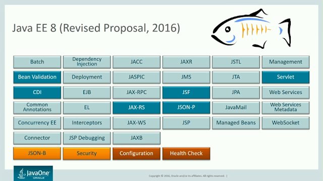


* **Bean Validation 2.0**
Esta es una especificación de java el cual nos permita expresar restricciones en los objetos usando anotaciones, además de crear nuestras propias restricciones. También proporciona las APIs para validar objetos así como su representación, y también valida los parámetros recibidos y los valores devueltos de los métodos y los constructores.

* **CDI 2.0**
Inyección de Contexto y Dependencia (Contexts and Dependency Injection) para  Java EE define un potente conjunto de servicios complementarios que nos ayudarán a mejorar la estructura del código de una aplicación. 

* **JAX-RS 2.1**
Eventos enviados por Servidor (del inglés Server-Sent Events (SSE)) es una tecnología nueva definida como parte de HTML 5 que establece recomendaciones para que un cliente obtenga actualizaciones desde el servidor HTTP de manera automática. Es comúnmente empleado para transmisiones de data streaming de un sentido, en el que el servidor actualiza su información y le notifica al cliente periódicamente, o cada vez que sucede un evento.

* **JAX-RS 2.0** 
Presenta APIS  de procesamiento asíncrono tanto para cliente como para servidor. 

* **JSF 2.3**
La tecnología JSF simplica la construcciones de interfaces para aplicaciones JavaServer. Los desarrolladores pueden construir rápidamente aplicaciones web para: ensamblar componentes UI reutilizables en una página, conectar estos componentes a una fuente de datos y conectar eventos en el cliente a los eventos del servidor. Ahora tenemos una característica llamada invocación Ajax que permite invocar métodos de un Managed Bean (CDI) directamente desde Ajax, permitiendo responder usando el estándar JSON.  Esta versión también permite validaciones en varios campos, @Inject FacesContext, rendimiento optimizado en EL, y aclaraciones Ajax cruzadas. Además, es compatible como MVC 1.0.

* **JSON-P 1.1**
Esta versión ofrece   JSON Patch, JSON Merge y JSON Pointer. También usa los streams y lambdas de Java SE 8.

* **Servlet 4.0**
Una de las características más esperadas para Java EE8 es HTTP/2.0 y Server Push, el cual  trae un aumento de rendimiento para las aplicaciones JSF. Solo basta con migrar a un servidor que sea compatible con Java EE 8.

* **JSON-B 1.0**
Es una capa de unión estándar para convertir objetos Java hacia y desde mensajes JSON. Define un algoritmo de mapeo por omisión para convertir clases Java existentes a JSON, y también permite al desarrolladores personalizar el proceso de mapeo a traves de anotaciones Java. Esto ya lo vimos en un post anterior: Un vistazo a JSON-B de Java EE8

* **Security API**
Este API es muy usado en el moderno paradigma de aplicaciones en la nube/PaaS. Promueve portabilidad en aplicaciones autocontenidas para todos los servidores Java EE, y promueve el uso de modernos conceptos de programación tales como lenguajes de expresión, e inyección de depedencia y contexto.

Video 
[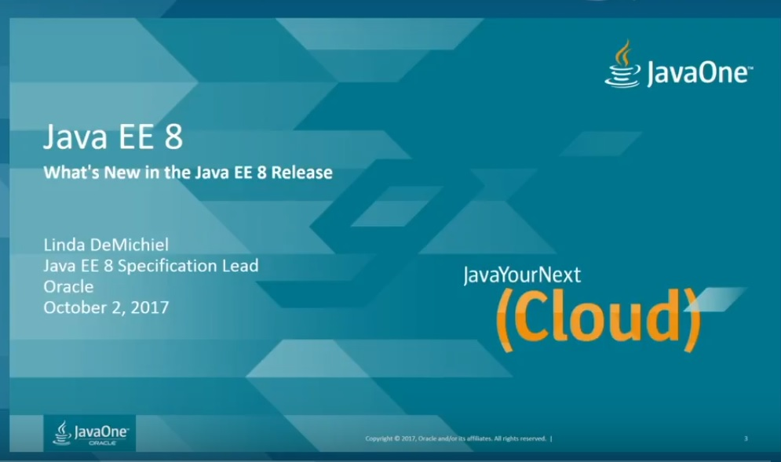](https://youtu.be/FCsqchsK9UA "Java EE8")

En el curso implementaremos una aplicación con la siguiente arquitectura.

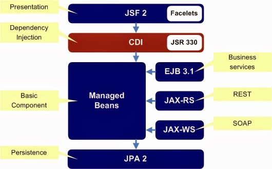

#### [Ir a Contenido](#content-id)
---

# <a name="req-id"></a>3. Requisitos de Software

En el siguiente enlace encontraras el software que debes instalar y configurar.

[Guia](https://drive.google.com/open?id=1QYuFhqT_IKzmI5Mu5cR4fPQRWYvm12sQ)

#### [Ir a Contenido](#content-id)
---

# <a name="pat-id"></a>4. Patrones de diseño
Una fase muy importante en el ciclo de vida de un proyecto es el Diseño del Software. Se trata de una etapa fundamental y en muchas ocasiones la más importante en el desarrollo de Software. Es el momento en que los profesionales tienen que aportar sus conocimientos, experiencia y creatividad para llegar a una solución que cumpla con los requisitos funcionales y no funcionales 
establecidos en la fase de la toma de requisitos.

Para ello debemos conocer y aplicar los patrones de diseño. Estos son soluciones (ya probadas y documentadas) a problemas de desarrollo conocidos.

En la implementación del la aplicación utilizaremos 4 patrones:

* [Patrón MVC (Model View Controller).](https://www.tutorialspoint.com/design_pattern/mvc_pattern.htm) 
* [Patrón DAO (Data Access Object).](https://www.tutorialspoint.com/design_pattern/data_access_object_pattern.htm)
* [Patrón TO (Transfer Object).](https://www.tutorialspoint.com/design_pattern/transfer_object_pattern.htm) 
* [Patrón DI (Dependency Injection).](https://es.wikipedia.org/wiki/Inyecci%C3%B3n_de_dependencias) 

Los invito a revisar el siguiente enlace de Martin Fowler para complementar esta sección.

* [Software Design](https://www.martinfowler.com/design.html). 

#### [Ir a Contenido](#content-id)
---
# <a name="pro-id"></a>5. Proyecto
Debes ingresar a tu IDE para crear un proyecto maven.

* Ir a `File` > `New` > `Maven Project`.

    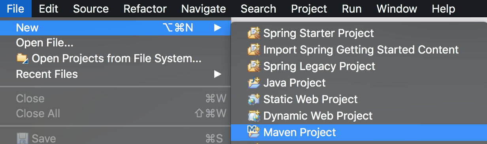

* Crearemos un proyecto simple, marca la opción `Create  a simple project(skip archetype selection)`.

    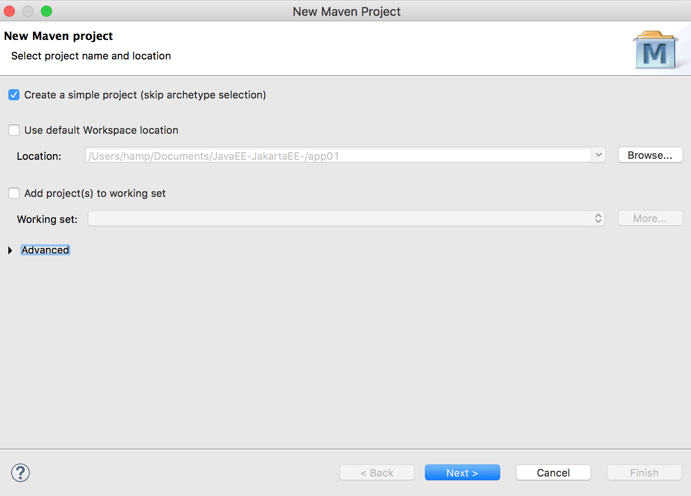

* Ingresamos los datos de `Group Id`, `Artifact Id` y seleccionamos como `Packaging` **war**  .

    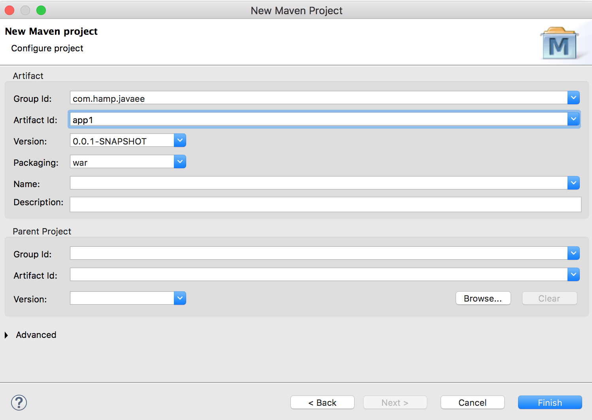

* Luego agregamos el siguiente bloque de codigo en el archivo `pom.xml`, para actualizar a Java 8 nuestro proyecto. No olvide guardar los cambios.

    ```xml
    <build>
		<plugins>
			<plugin>
				<groupId>org.apache.maven.plugins</groupId>
				<artifactId>maven-compiler-plugin</artifactId>
				<version>3.6.1</version>
				<configuration>
					<source>1.8</source>
					<target>1.8</target>
				</configuration>
			</plugin>
		</plugins>
	</build>
    ```
* El siguiente mensaje de error se genera porque necesitamos generar el archivo `web.xml`.

    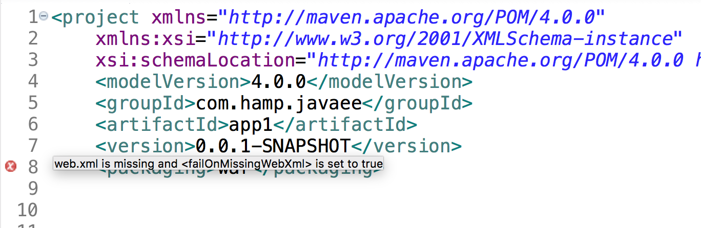

    Para generar este archivo debes dar click derecho en el proyecto y seleccionar `Generate Deployment Descriptor Sub`.

    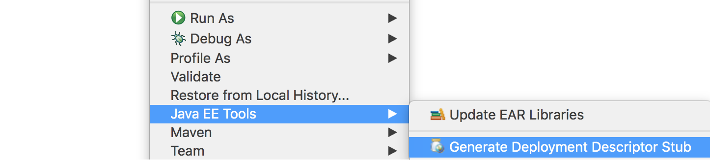
  
    Debemos actualizar el codigo del archivo `web.xml` por el siguiente.

    ```xml
    <?xml version="1.0" encoding="UTF-8"?>
    <web-app version="3.1" xmlns="http://xmlns.jcp.org/xml/ns/javaee"
        xmlns:xsi="http://www.w3.org/2001/XMLSchema-instance"
        xsi:schemaLocation="http://xmlns.jcp.org/xml/ns/javaee http://xmlns.jcp.org/xml/ns/javaee/web-app_3_1.xsd">

        <display-name>app1</display-name>
        <welcome-file-list>
            <welcome-file>index.jsp</welcome-file>
        </welcome-file-list>
    </web-app>
    ```

    Luego para actualizar el proyecto debes dar nuevamente click derecho y elegir `Maven` > `Update Project`.

    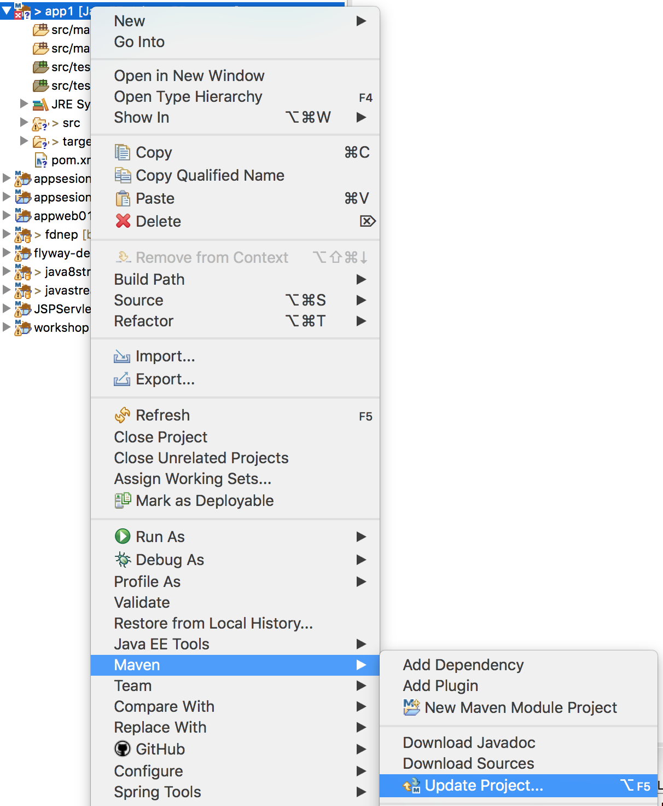

* Debemos agregar las siguientes dependencias en el archivo `pom.xml`. 

    ```xml
    <dependencies>
		<dependency>
			<groupId>javax</groupId>
			<artifactId>javaee-api</artifactId>
			<version>8.0</version>
			<scope>provided</scope>
		</dependency>

		<dependency>
			<groupId>javax.servlet</groupId>
			<artifactId>javax.servlet-api</artifactId>
			<version>4.0.1</version>
			<scope>provided</scope>
		</dependency>
	</dependencies>
    ```

#### [Ir a Contenido](#content-id)
---
# <a name="sp-id"></a>6. Servlet- JavaServer Pages (JSP)
Antes de iniciar con la creación de un Servlet y JSP en el proyecto creado en la sección anterior revisa el siguiente video.
[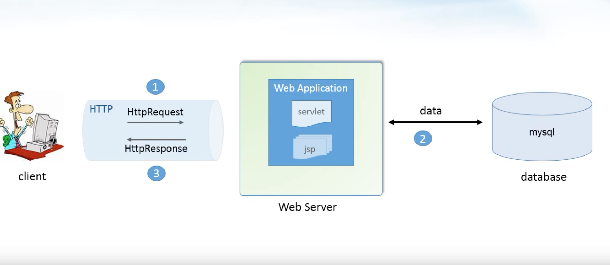](https://www.youtube.com/watch?v=cWCVSNqjy5Q "ServletJSP")

#### [Ir a Contenido](#content-id)
--- 

## <a name="servlet-id"></a>6.1 Servlet.
Servlet API es un componente fundamental de la parte principal del servidor Java y parte de las tecnologías Java EE,como JAX-RS para servicios web, JSF (JavaServer Faces) y JSP (JavaServer Pages). Dentro de sus caracteristicas incluyen filtros, seguridad web y características para manejar solicitudes y respuestas HTTP.

En el siguiente enlace podras encontrar videos sobre las nuevas caracteristicas de [Servlet 4.0 ](https://www.ibm.com/developerworks/library/j-javaee8-servlet4/index.html).

#### [Ir a Contenido](#content-id)
--- 

## <a name="jsp-id"></a>6.2 JavaServer Pages (JSP)

Los JavaServer Pages son páginas que permiten vincular parte de lógica java, si en los servlet tenemos una clase y metemos código html aquí es lo contrario, estas permiten crear contenido web dinámico que luego se procesa traduciendo el jsp a un servlet que es compilado y ejecutado.

Junto con JSP, se suele trabajar también con  [JSTL (JavaServer Pages Standard Tag Library)](https://www.tutorialspoint.com/jsp/jsp_standard_tag_library.htm)., una de las muchas librerías de etiquetas que podemos utilizar, que sirve para extenderla.

En el siguiente enlace podras encontrar mas información sobre [JSP ](https://www.ibm.com/developerworks/java/tutorials/j-introjsp/j-introjsp.html).

#### [Ir a Contenido](#content-id)
--- 

## <a name="ejerservletjsp-id"></a>6.3 Ejercicio
Bueno ahora si manos a la obra, Cabe indicar que este ejercicio sera implementado utilizando el Patrón MVC.
* Model: Un Java Class que tendra la información de `Student`.
* Controller:  Un Servlet `StudentController` para la gestión de las peticiones y respuestas mediante el protocolo HTTP.
* View:  Un JSP que contendra el HTML, CSS y el uso de JSTL para extender su funcionalidad.

y Patrón TO para separar la logica de negocio en un Java Class.
* Service: Un Java Class `StudentService` donde se implemente la logica de negocio.

A continuación los pasos a seguir.

* Creamos el Java Class `Student`.

    ```java
    package com.hamp.javaee.model;

        public class Student {           
            private int id;
            private String firstName;
            private String lastName;
                    
            // constructors, getters and setters  here

        }

    ```

* Creamos el Java Class `StudentService`

    ```java
        package com.hamp.javaee.service;

        import java.util.Optional;

        import com.hamp.javaee.model.Student;

        public class StudentService {

            public Optional<Student> getStudent(int id) {
                switch (id) {
                case 1:
                    return Optional.of(new Student(1, "Henry", "Mendoza Puerta"));
                case 2:
                    return Optional.of(new Student(2, "Alexandra", "Melendez Leon"));
                case 3:
                    return Optional.of(new Student(3, "Max", "Sanchez Rodriguez"));
                default:
                    return Optional.empty();
                }
            }

        }

     ```

* Creamos el Servlet `StudentController`    

    ```java
        package com.hamp.javaee.controller;

        import java.io.IOException;

        import javax.servlet.RequestDispatcher;
        import javax.servlet.ServletException;
        import javax.servlet.annotation.WebServlet;
        import javax.servlet.http.HttpServlet;
        import javax.servlet.http.HttpServletRequest;
        import javax.servlet.http.HttpServletResponse;

        import com.hamp.javaee.service.StudentService;


        @WebServlet("/StudentController")
        public class StudentController extends HttpServlet {
            private static final long serialVersionUID = 1L;
            private final StudentService studentService = new StudentService();


            public StudentController() {
                super();
                // TODO Auto-generated constructor stub
            }

            
            protected void doGet(HttpServletRequest request, HttpServletResponse response)
                    throws ServletException, IOException {
                // TODO Auto-generated method stub
                response.getWriter().append("Served at: ").append(request.getContextPath());
            }

            
            protected void doPost(HttpServletRequest request, HttpServletResponse response)
                    throws ServletException, IOException {
                // TODO Auto-generated method stub
                String studentID = request.getParameter("id");
                if (studentID != null) {
                    int id = Integer.parseInt(studentID);
                    studentService.getStudent(id).ifPresent(s -> request.setAttribute("studentRecord", s));
                }

                RequestDispatcher dispatcher = request.getRequestDispatcher("/result.jsp");
                dispatcher.forward(request, response);
            }

        }

     ```
* Creamos las vistas `index.jsp` y `result.jsp`

    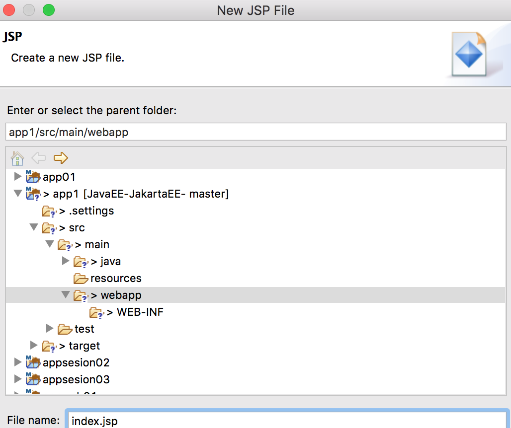

    ```jsp
        <%@ page contentType="text/html;charset=UTF-8" language="java"%>
        <html>
        <head>
        <title>Servlet-JSP</title>
        </head>
        <body>

            <form name="bmiForm" action="StudentController" method="POST">

                <table>
                    <tr>
                        <td>Id :</td>
                        <td><input type="text" name="id" /></td>
                    </tr>

                    <input type="submit" value="Submit" name="Send" />

                </table>

            </form>

        </body>
        </html>

     ```


    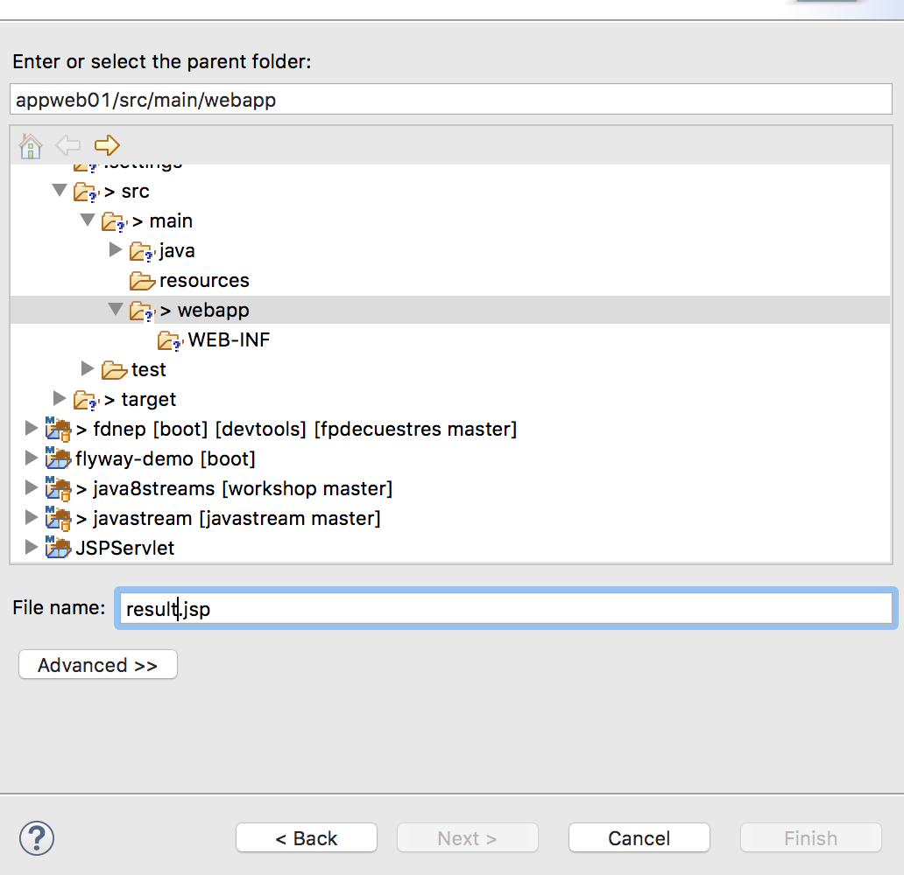

    ```jsp
        <%@ page language="java" contentType="text/html; charset=ISO-8859-1"
        pageEncoding="ISO-8859-1"%>

        <%@ page import="com.hamp.javaee.model.Student"%>
        <!DOCTYPE html PUBLIC "-//W3C//DTD HTML 4.01 Transitional//EN" "http://www.w3.org/TR/html4/loose.dtd">
        <html>
        <head>
        <meta http-equiv="Content-Type" content="text/html; charset=ISO-8859-1">
        <title>Student Record</title>
        </head>
        <body>
            <%
                if (request.getAttribute("studentRecord") != null) {
                    Student student = (Student) request.getAttribute("studentRecord");
            %>

            <h1>Student Record</h1>
            <div>
                ID:
                <%=student.getId()%></div>
            <div>
                First Name:
                <%=student.getFirstName()%></div>
            <div>
                Last Name:
                <%=student.getLastName()%></div>

            <%
                } else {
            %>
            <h1>No student record found.</h1>
            <%
                }
            %>
        </body>
        </html>

     ```

#### [Ir a Contenido](#content-id)
---
# <a name="jsfcdi-id"></a>7. Java Server Faces (JSF) y Context Dependency Injection (CDI)
Contexts and Dependency Injection (CDI) se integra principalmente con `JavaServer Faces (JSF)` a través del `lenguaje de expresiones (EL)`. Permite que los `beans CDI` se expongan a través de los componentes EL-to-JSF unificados. También proporciona un contexto integrado para el ámbito de conversación que está activo durante las fases del ciclo de vida JSF estándar.

Para mas información sobre [lenguaje de expresiones (EL)](https://www.apuntesdejava.com/2014/10/tutorial-jsf-22-sesion-9-lenguaje-de.html) 

## <a name="jsf-id"></a>7.1. Java Server Faces (JSF)
JSF es una tecnología que fué creada para simplificar la creación de interfaces web de usuario para aplicaciones web JavaEE.

Mediante ejemplos prácticos analizaremos las características de este framework, utilizando diferentes herramientas de desarrollo para crear nuestras aplicaciones web Java con JSF e integrarlas con otras tecnologías Java como EJB y JPA.

Algunas de las características principales de JSF son:

* Es un marco de trabajo (framework) para crear aplicaciones JavaEE basadas en el patrón de diseño MVC (Modelo-Vista-Controlador) y utilizando la API de Servlets.
* Utiliza páginas JSP para generar las vistas, añadiendo una biblioteca de etiquetas propia para crear componentes reutilizables: JavaScript, HTML, CSS, … que podrán ser desplegados en cualquier tipo de cliente (navegadores, móviles, …), ahorrando mucho tiempo en el desarrollo de aplicaciones web. Este concepto se conoce como Render Kits.
* JSF resuelve validaciones, conversiones, mensajes de error e internacionalización (i18n).
* Es extensible, pudiendo crearse nuevos elementos de la interfaz o modificar los ya existentes. JSF dispone de varias implementaciones diferentes, incluyendo un conjunto de etiquetas y APIs estándar que forman el núcleo del framework. Algunas de las implementaciones son: PrimeFaces, RichFaces, IceFaces, cada una de las cuales contiene un número diferente de componentes.
* Soporte nativo para AJAX, por tanto, facilita el tratamiento de peticiones asíncronas.
* Soporte por defecto para el uso de la tecnología de Facelets.


**Arquitectura general**:

En el caso de JSF  la definición de la interfaz se realiza en forma de páginas XHTML con distintos tipos de etiquetas que veremos más adelante. Estas páginas se denominan páginas JSF. La siguiente figura muestra el funcionamiento de JSF para generar una página por primera vez.

El navegador realiza una petición a una determinada URL en la que reside la página JSF que se quiere mostrar. En el servidor un servlet que llamamos motor de JSF recibe la petición y construye un árbol de componentes a partir de la página JSF que se solicita. Este árbol de componentes replica en forma de objetos Java la estructura de la página JSF original y representa la estructura de la página que se va a devolver al navegador. Una vez construido el árbol de componentes, se ejecuta código Java en el servidor para rellenar los elementos del árbol con los datos de la aplicación. Por último, a partir del árbol de componentes se genera la página HTML que se envía al navegador.

**MVC con JSF**
* Lado del cliente: 

    Vistas web: HTML, CSS.

* Lado  del servidor:   
    Capa de Presentación: JSF, Primefaces.  
    Capa de Negocio (objetos de negocio): EJB.  
    Capa de Datos (objetos entidad): JPA.


    

#### [Ir a Contenido](#content-id)
--- 

## <a name="cdi-id"></a>7.2. Context Dependency Injection (CDI)

Contexts and Dependency Injection (CDI) es el marco de inyección de dependencia primario de Java EE. Fue presentado con Java EE 6 en 2009. CDI se está convirtiendo lentamente en la columna vertebral de todos de Java EE. JSF 2.3, por ejemplo, ha desaprobado por completo su propio modelo de beans gestionados (@ManagedBean) por  la inyección de dependencias a favor de CDI mediante el uso de @Named.

CDI se activa en una aplicación mediante la presencia de un archivo `beans.xml` dentro de ese módulo, tal como se define en la especificación `JSR 299`. Puede encontrar el archivo `beans.xml` en el directorio `WEB-INF`. Cuando se activa, el contenedor proporciona servicios tales como:

* Gestión de contexto
* Inyección de dependencia de tipo seguro: se crea una instancia de un bean gestionado por CDI y se inyecta cuando sea necesario.
* Decoradores, que implementan una o más interfaces de bean y que pueden contener lógica empresarial. Los decoradores están inhabilitados de forma predeterminada. Puede tener varios decoradores por bean, y el orden se define mediante el archivo beans.xml.
* Enlaces de interceptor. Los interceptores, que se habilitan manualmente en el archivo beans.xml, se enlazan mediante un tipo de enlace de interceptor.
* Integración en archivos JavaServer Faces (JSF) y JavaServer Pages (JSP) utilizando el Lenguaje de Expresión (EL)

#### [Ir a Contenido](#content-id)
--- 

## <a name="ejerjsfcdi-id"></a>7.3. Ejercicio

Bueno ahora si manos a la obra, Cabe indicar que este ejercicio sera implementado utilizando el Patrón MVC.

* Model: es el encargado de almacenar los datos de la aplicación web. Se puede implementar con clases java (POJO: Plain Old Java Object) o con Managed Bean de modelo.
* View: define la interfaz de usuario utilizando JSF (Facelets) y primefaces para desplegar la información del modelo.
* Controller: define el flujo de la aplicación y las interacciones del usuario. Se puede implementar con Managed Bean de control.

Debes crear un nuevo proyecto como se hizo en la sección de [Proyecto](#pro-id) y el archivo `pom.xml` es el siguiente.

```xml

    <project xmlns="http://maven.apache.org/POM/4.0.0"
	xmlns:xsi="http://www.w3.org/2001/XMLSchema-instance"
	xsi:schemaLocation="http://maven.apache.org/POM/4.0.0 http://maven.apache.org/xsd/maven-4.0.0.xsd">
	<modelVersion>4.0.0</modelVersion>
	<groupId>com.hamp.javaee</groupId>
	<artifactId>appweb02</artifactId>
	<version>0.0.1-SNAPSHOT</version>
	<packaging>war</packaging>


	<dependencies>
		<dependency>
			<groupId>javax</groupId>
			<artifactId>javaee-api</artifactId>
			<version>8.0</version>
			<scope>provided</scope>
		</dependency>

		<dependency>
			<groupId>javax.faces</groupId>
			<artifactId>javax.faces-api</artifactId>
			<version>2.3</version>
			<scope>provided</scope>
		</dependency>

		<dependency>
			<groupId>org.primefaces</groupId>
			<artifactId>primefaces</artifactId>
			<version>6.2</version>
		</dependency>

		<dependency>
			<groupId>org.primefaces.themes</groupId>
			<artifactId>all-themes</artifactId>
			<version>1.0.10</version>
		</dependency>
	</dependencies>

	<repositories>
		<repository>
			<id>prime-repo</id>
			<name>PrimeFaces Maven Repository</name>
			<url>http://repository.primefaces.org</url>
			<layout>default</layout>
		</repository>
	</repositories>

	<build>
		<finalName>appweb02</finalName>
		<plugins>
			<plugin>
				<groupId>org.apache.maven.plugins</groupId>
				<artifactId>maven-compiler-plugin</artifactId>
				<version>3.1</version>
				<configuration>
					<source>1.8</source>
					<target>1.8</target>
				</configuration>
			</plugin>
		</plugins>
	</build>

</project>
```
Luego debes cambiar el contenido del archivo `web.xml` por el siguiente.

```xml
    <?xml version="1.0" encoding="UTF-8"?>
    <web-app version="3.1"
        xmlns="http://xmlns.jcp.org/xml/ns/javaee"
        xmlns:xsi="http://www.w3.org/2001/XMLSchema-instance"
        xsi:schemaLocation="http://xmlns.jcp.org/xml/ns/javaee http://xmlns.jcp.org/xml/ns/javaee/web-app_3_1.xsd">

        <servlet>
            <servlet-name>Faces Servlet</servlet-name>
            <servlet-class>javax.faces.webapp.FacesServlet</servlet-class>
            <load-on-startup>1</load-on-startup>
        </servlet>

        <servlet-mapping>
            <servlet-name>Faces Servlet</servlet-name>
            <url-pattern>*.xhtml</url-pattern>
        </servlet-mapping>

        <welcome-file-list>
            <welcome-file>index.xhtml</welcome-file>
        </welcome-file-list>

    </web-app>

```
* Activar CDI en el Proyecto con `beans.xml`.

    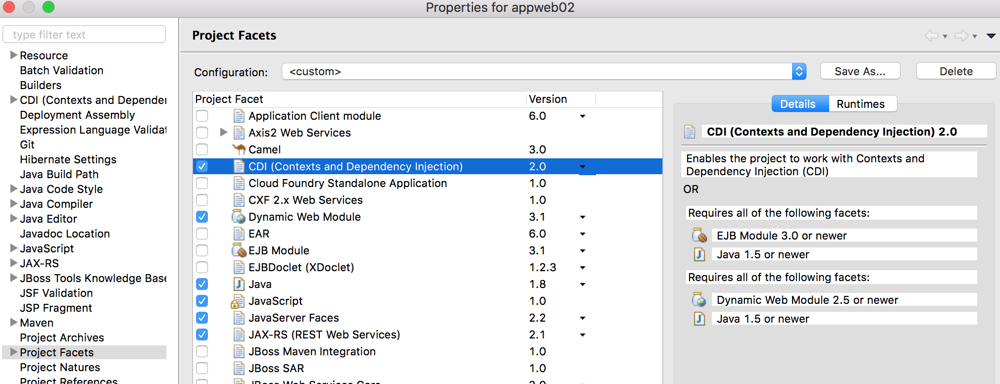

    ```xml
        <?xml version="1.0"?>
        <beans bean-discovery-mode="all" version="1.1"
        xmlns="http://xmlns.jcp.org/xml/ns/javaee"
        xmlns:xsi="http://www.w3.org/2001/XMLSchema-instance"         
        xsi:schemaLocation="http://xmlns.jcp.org/xml/ns/javaee 
        http://xmlns.jcp.org/xml/ns/javaee/beans_1_1.xsd"/>
    ```

* Creamos Java Class Modelo `Person`.

    ```java
    package com.hamp.javaee.model;

    import java.io.Serializable;

    public class Person implements Serializable {

        private int idPerson;
        private String name;
        private String lastName;
        private int age;

        public int getIdPerson() {
            return idPerson;
        }

        public void setIdPerson(int idPerson) {
            this.idPerson = idPerson;
        }

        public String getName() {
            return name;
        }

        public void setName(String name) {
            this.name = name;
        }

        public String getLastName() {
            return lastName;
        }

        public void setLastName(String lastName) {
            this.lastName = lastName;
        }

        public int getAge() {
            return age;
        }

        public void setAge(int age) {
            this.age = age;
        }

    }

    ```

* Creamos interface DAO generica `IDAO`.

    
    ```java
    package com.hamp.javaee.dao;

    import java.util.List;

    public interface IDAO<T> {
        List<T> findAll();
    }

    ```

* Creamos Interface DAO  `IPersonDAO`.

    ```java
    package com.hamp.javaee.dao;

    import com.hamp.javaee.model.Person;

    public interface IPersonDAO extends IDAO<Person> {

    }

    ```

* Creamos Java Class DAO `PersonDAO`.

    ```java
        package com.hamp.javaee.dao.impl;

        import java.io.Serializable;
        import java.util.ArrayList;
        import java.util.List;

        import javax.inject.Named;

        import com.hamp.javaee.dao.IPersonDAO;
        import com.hamp.javaee.model.Person;

        @Named
        public class PersonDAO implements IPersonDAO,Serializable {

            
            private static final long serialVersionUID = 1L;

            @Override
            public List<Person> findAll() {
                List<Person> lista = new ArrayList<>();
                for (int i = 0; i < 100; i++) {
                    Person per = new Person();
                    per.setIdPerson(i);
                    per.setName("Henry Antonio");
                    per.setLastName("Mendoza Puerta");
                    per.setAge(38);
                    lista.add(per);
                }

                return lista;
            }

        }

    ```

* Creamos interface Service `IPersonService`.
    
    ```java
        package com.hamp.javaee.service;

        import java.util.List;

        import com.hamp.javaee.model.Person;

        public interface IPersonService {
            
            List<Person> findAll();

        }
    ```

* Creamos Java Class Service `PersonService`.

    ```java
        package com.hamp.javaee.service.impl;

        import java.io.Serializable;
        import java.util.List;

        import javax.inject.Inject;
        import javax.inject.Named;

        import com.hamp.javaee.dao.IPersonDAO;
        import com.hamp.javaee.model.Person;
        import com.hamp.javaee.service.IPersonService;

        @Named
        public class PersonService implements IPersonService, Serializable{


            private static final long serialVersionUID = 1L;
            @Inject
            private IPersonDAO pdao;

            @Override
            public List<Person> findAll() {
                // TODO Auto-generated method stub
                return pdao.findAll();
            }

        }

    ```

* Creamos Java Class Controller `PersonController`.

    ```java
        package com.hamp.javaee.controller;

        import java.util.ArrayList;
        import java.util.List;

        import javax.annotation.PostConstruct;
        import javax.faces.view.ViewScoped;
        import javax.inject.Inject;
        import javax.inject.Named;

        import com.hamp.javaee.model.Person;
        import com.hamp.javaee.service.IPersonService;


        import java.io.Serializable;

        @Named
        @ViewScoped
        public class PersonController implements Serializable {

            
            private static final long serialVersionUID = 1L;
            
            private List<Person> listPersons;
            private Person person;

            @Inject
            private IPersonService pService;

            public PersonController() {
                listPersons = new ArrayList<>();

            }

            @PostConstruct
            public void init() {
                this.findAdll();
            }

            public void findAdll() {
                this.listPersons = pService.findAll();
            }
            
            public void showPerson(Person per) {
                this.person = per;
            }

            public List<Person> getListPersons() {
                return listPersons;
            }

            public void setListPersons(List<Person> listPersons) {
                this.listPersons = listPersons;
            }

            public Person getPerson() {
                return person;
            }

            public void setPerson(Person person) {
                this.person = person;
            }

        }

    ```
* Creamos Java Class Controller `IndexController`.

    ```java
        package com.hamp.javaee.controller;

        import java.io.Serializable;

        import javax.faces.view.ViewScoped;
        import javax.inject.Named;

        @Named
        @ViewScoped
        public class IndexController implements Serializable {

            private static final long serialVersionUID = 1L;

            public String login() {
                String redireccion = null;
                try {

                    redireccion = "/protegido/persons?faces-redirect=true";

                } catch (Exception e) {
                    e.printStackTrace();
                }
                return redireccion;
            }

        }

    ```
* Creamos folder `resources` dentro del folder `webapp` y un folder `css` dentro del folder `resources`.


    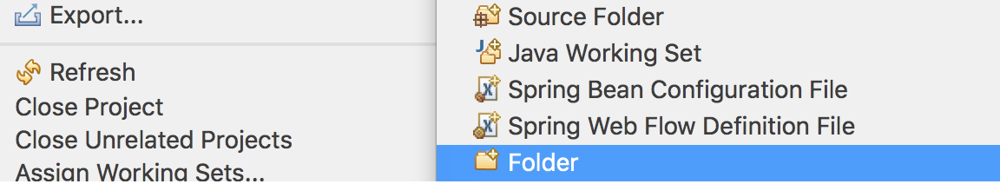

   
* Creamos 2 archivos css dentro del folder `css` con el nombre de `estilos.css` y `index.css`.

    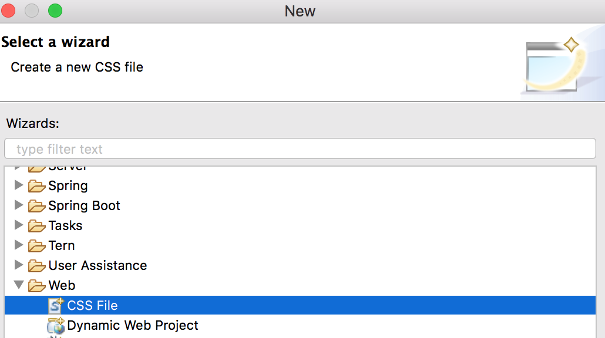

    Archivo estilos.css 
    ```css
       .resolucion {     
            width: 800px; margin: 0 auto;            
        }

        .ui-widget {
            font-size: 82% !important;
        }
        .ui-widget .ui-widget {
            font-size: 100% !important;
        }

        body{
            font-family: Lato; 
        }

    ```

    Archivo index.css 
    ```css
       .centerDiv {
            width: 100px;
            height: 100px;

            position: absolute;
            top:0;
            bottom: 0;
            left: 0;
            right: 0;

            margin: auto;
        }

        .registrarDiv {
            width: 100px;
            height: 100px;

            position: absolute;
            top: 0;
            bottom: 0;
            left: 0;
            right: 0;

            margin: auto;
            margin-top: -1px;
        }

        .ui-widget {
            font-size: 90%;
        }
        .ui-widget .ui-widget {
            font-size: 100%;
        }

        body {
            background-color: #ffffff;
            font-size: 12px;
            font-family: Verdana, "Verdana CE",  Arial, "Arial CE", "Lucida Grande CE", lucida, "Helvetica CE", sans-serif;
            color: #000000;  
            margin: 10px;
        }

        h1 {
            
            font-family: Arial, "Arial CE", "Lucida Grande CE", lucida, "Helvetica CE", sans-serif;
            border-bottom: 1px solid #AFAFAF; 
            font-size:  16px;
            font-weight: bold;
            margin: 0px;
            padding: 0px;
            color: #D20005;
        }

        a:link, a:visited {
        color: #045491;
        font-weight : bold;
        text-decoration: none;
        }

        a:link:hover, a:visited:hover  {
        color: #045491;
        font-weight : bold;
        text-decoration : underline;
        }
    ```
* Creamos un folder  `templates` dentro de `WEB-INF`.

    

* Creamos Facelets `master.xhtml` dentro del folder `templates`.

    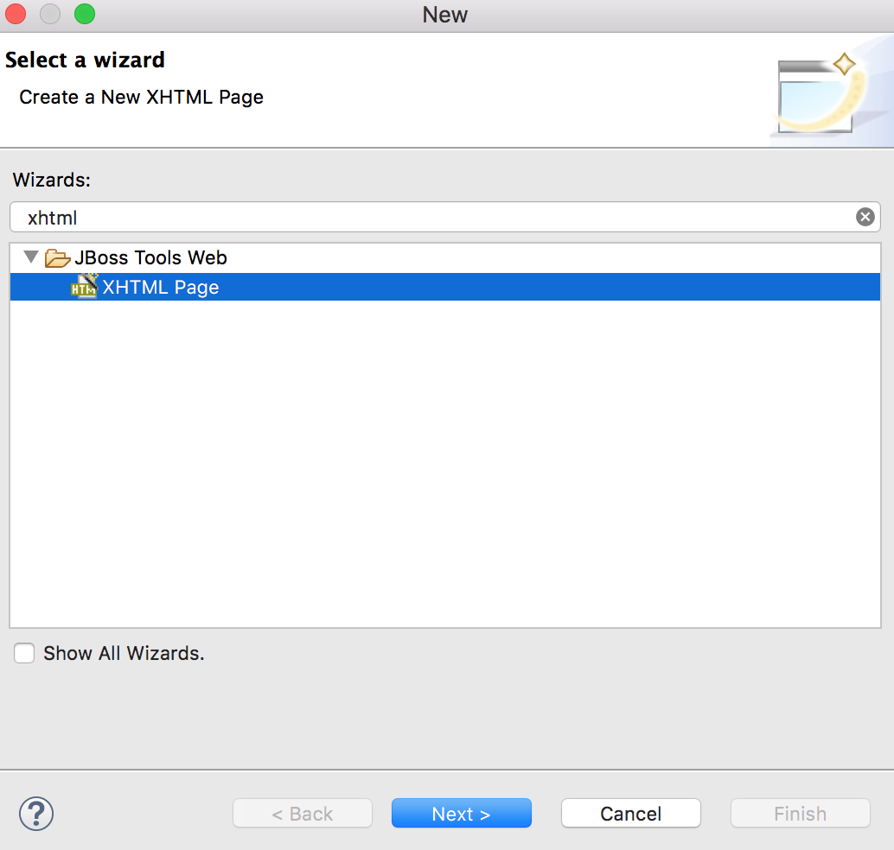

    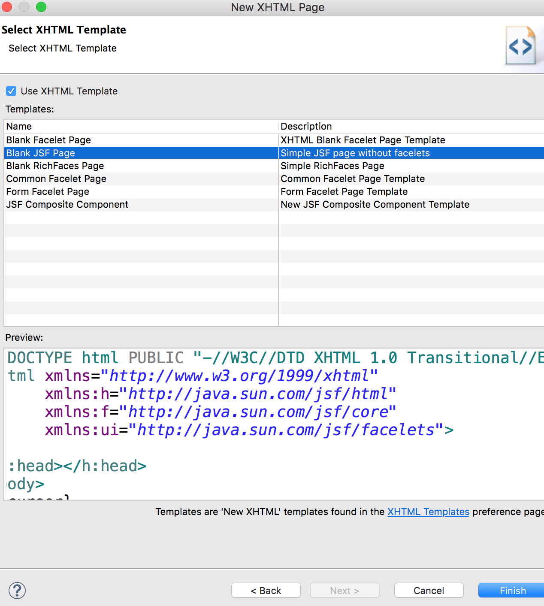

    ```xml

    <!DOCTYPE html PUBLIC "-//W3C//DTD XHTML 1.0 Transitional//EN" "http://www.w3.org/TR/xhtml1/DTD/xhtml1-transitional.dtd">
        <html xmlns="http://www.w3.org/1999/xhtml"
            xmlns:ui="http://java.sun.com/jsf/facelets"
            xmlns:f="http://java.sun.com/jsf/core"
            xmlns:h="http://java.sun.com/jsf/html"
            xmlns:p="http://primefaces.org/ui">

        <h:head>
            <h:outputStylesheet library="css" name="estilos.css" />
        </h:head>
        <body class="resolucion">
            <ui:insert name="header">
                <h:form>
                    <p:menubar autoDisplay="false">
                        <p:menuitem icon="ui-icon-home" value="Inicio" url="#" />

                        <p:submenu label="Mantenedores" icon="ui-icon-pencil">
                            <p:menuitem icon="ui-icon-document" value="Personas"
                                url="/protegido/persons.xhtml" />
                            <p:menuitem icon="ui-icon-document" value="Usuarios" url="#" />
                        </p:submenu>

                        <f:facet name="options">
                            <p:commandButton icon="ui-icon-power" url="/index.xhtml" />
                        </f:facet>

                    </p:menubar>
                </h:form>
            </ui:insert>

            <ui:insert name="content">

            </ui:insert>


            <ui:insert name="footer">
                <div>Copyright © HAMP, 2018. Todos los derechos reservados</div>
            </ui:insert>
        </body>
        </html>
    ```

* Creamos un folder  con nombre `protegido` dentro de `webapp`.

    

* Creamos Facelets `persons.xhtml` dentro del folder `protegido`.

    

    

    ```xml
    <!DOCTYPE html PUBLIC "-//W3C//DTD XHTML 1.0 Transitional//EN" "http://www.w3.org/TR/xhtml1/DTD/xhtml1-transitional.dtd">
    <html xmlns="http://www.w3.org/1999/xhtml"
        xmlns:ui="http://java.sun.com/jsf/facelets"
        xmlns:f="http://java.sun.com/jsf/core"
        xmlns:h="http://java.sun.com/jsf/html"
        xmlns:p="http://primefaces.org/ui">
    <h:head></h:head>
    <body>

        <ui:composition template="/WEB-INF/templates/master.xhtml">

            <ui:define name="content">
        Personas
        <h:form id="frm">
                    <p:dataTable value="#{personController.listPersons}" var="p"
                        stickyHeader="true" rows="10" paginator="true"
                        paginatorTemplate="{CurrentPageReport} {FirstPageLink} {PreviousPageLink} {PageLinks} {NextPageLink} {LastPageLink} {RowsPerPageDropdown}"
                        rowsPerPageTemplate="5,10,15">

                        <p:column headerText="ID">
                            <p:outputLabel value="#{p.idPerson}" />
                        </p:column>

                        <p:column headerText="Nombres">
                            <p:outputLabel value="#{p.name}" />
                        </p:column>

                        <p:column headerText="Apellidos">
                            <p:outputLabel value="#{p.lastName}" />
                        </p:column>

                        <p:column headerText="Edad">
                            <p:outputLabel value="#{p.age}" />
                        </p:column>

                        <p:column headerText="Acción">
                            <p:commandLink value="Ver" oncomplete="PF('dlg').show()"
                                actionListener="#{personController.showPerson(p) }"
                                update="frm:dialogo" />
                        </p:column>


                    </p:dataTable>

                    <p:dialog id="dialogo" widgetVar="dlg" header="Elemento"
                        modal="true" closeOnEscape="true" draggable="true"
                        resizable="false" showEffect="explode">
                        #{personController.person.idPerson}
                        #{personController.person.name}
                        #{personController.person.lastName}
                    </p:dialog>
                </h:form>
            </ui:define>
        </ui:composition>
    </body>
    </html>

    ```

* Creamos Facelets `index.xhtml` dentro del folder `webapp`.

    

    

    ```xml
        <!DOCTYPE html PUBLIC "-//W3C//DTD XHTML 1.0 Transitional//EN" "http://www.w3.org/TR/xhtml1/DTD/xhtml1-transitional.dtd">
        <html xmlns="http://www.w3.org/1999/xhtml"
            xmlns:ui="http://java.sun.com/jsf/facelets"
            xmlns:f="http://java.sun.com/jsf/core"
            xmlns:h="http://java.sun.com/jsf/html"
            xmlns:p="http://primefaces.org/ui">

        <h:head>
            <link href="./resources/css/index.css" rel="stylesheet" type="text/css" />
        </h:head>
        <body>

            <h:form>
                <div class="centerDiv" style="width: 400px">
                    <p:panel>
                        <f:facet name="header">Login</f:facet>
                        <h:panelGrid columns="2">
                            <p:outputLabel for="txtLogin" value="Usuario:" />
                            <h:inputText id="txtLogin" />
                            <p:outputLabel for="txtContrasena" value="Contraseña:" />
                            <h:inputSecret id="txtContrasena" />
                        </h:panelGrid>
                        <p:commandButton value="Login" action="#{indexController.login()}" />

                    </p:panel>
                </div>
            </h:form>
        </body>
        </html>
    ```

    * Ejecuta la aplicación dando click derecho al proyecto.

        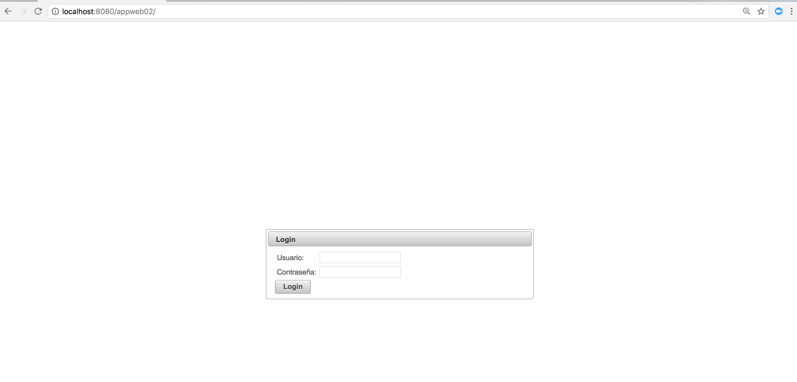

        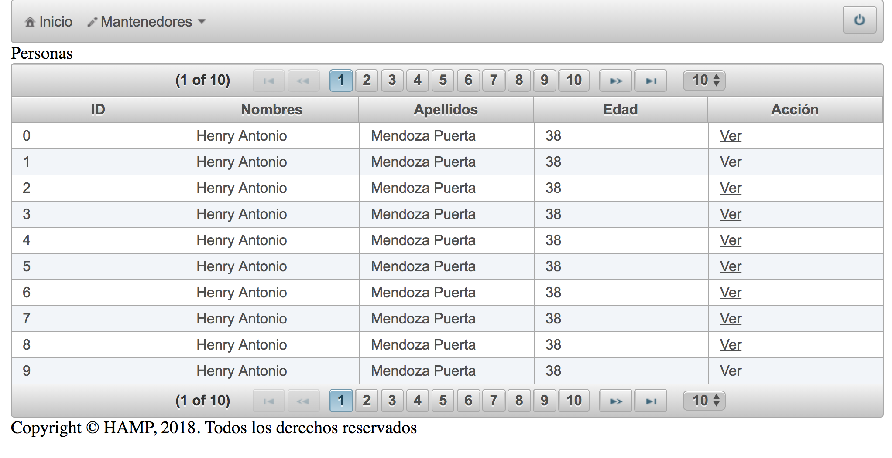

#### [Ir a Contenido](#content-id)
---

# <a name="jdbc-id"></a>8. Java Database Connectivity (JDBC)
JDBC es un API (Application programming interface) que describe o define una librería estándar para acceso a fuentes de datos, principalmente orientado a Bases de Datos relacionales que usan SQL (Structured Query Language). JDBC no sólo provee un interfaz para acceso a motores de bases de datos, sino que también define una arquitectura estándar, para que los fabricantes puedan crear los drivers que permitan a las aplicaciones java el acceso a los datos.

Revisar: [JDBC](https://www.tutorialspoint.com/jdbc/)
    

#### [Ir a Contenido](#content-id)
--- 

## <a name="ejerjdbc-id"></a>8.1. Ejercicio

* Agregar la dependencia del `driver de mysql` al archivo `pom.xml`.

```xml
<dependency>
	<groupId>mysql</groupId>
	<artifactId>mysql-connector-java</artifactId>
	<version>5.1.6</version>
</dependency>
```
* Crear un archivo de `Properties` dentro de `src/main/java`.

    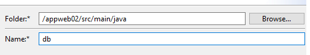

  indicamos las siguientes propiedades.

  ```xml
    driver=com.mysql.jdbc.Driver   
    url=jdbc:mysql://localhost:3306/dbcrud    
    user=root    
    password=adminadmin
  ```

* Crear Java Class con el nombre de `Conexion` en el paquete `com.hamp.javaee.dao`.

    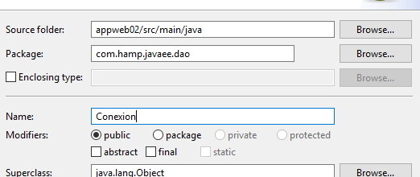

* El codigo de la clase `Conexion` es el siguiente.

  ```java
    package com.hamp.javaee.dao;

    import java.io.InputStream;
    import java.sql.Connection;
    import java.sql.DriverManager;
    import java.util.Properties;

    public class Conexion {

        protected static Connection cx; 
                
        public static Connection conectar() {
            if(cx != null) {
                return cx;
            }
            
            InputStream inputStream = Conexion.class.getClassLoader().getResourceAsStream("db.properties");
            Properties properties = new Properties();	
            
            try {
                properties.load(inputStream);
                String driver = properties.getProperty("driver");
                String url = properties.getProperty("url");
                String user = properties.getProperty("user");
                String password = properties.getProperty("password");
                Class.forName(driver);
                cx = DriverManager.getConnection(url, user, password);
                System.out.println("Se conect� a la base de datos");
            }catch(Exception e) {
                e.printStackTrace();
            }
            return cx;
        }
        
        public static void desconectar(){
            if(cx == null){
                return;
            }
            
            try{
                cx.close();
            }catch(Exception e){
                e.printStackTrace();
            }
        }
    }
  ```
* Editamos el codigo de la clase `PersonDAO` por el siguiente.
  
  ```java
    package com.hamp.javaee.dao.impl;

    import java.io.Serializable;
    import java.sql.Connection;
    import java.sql.ResultSet;
    import java.sql.Statement;
    import java.util.ArrayList;
    import java.util.List;

    import javax.inject.Named;

    import com.hamp.javaee.dao.Conexion;
    import com.hamp.javaee.dao.IPersonDAO;
    import com.hamp.javaee.model.Person;

    @Named
    public class PersonDAO implements IPersonDAO, Serializable {

        private static final long serialVersionUID = 1L;

        private Connection cx;

        public PersonDAO() {
            cx = Conexion.conectar();
        }

        @Override
        public List<Person> findAll() {
            List<Person> lista = new ArrayList<>();
            try {
                Statement statement = cx.createStatement();
                ResultSet resultSet = statement.executeQuery("SELECT * FROM Person");
                while (resultSet.next()) {
                    Person person = new Person();
                    person.setIdPerson(resultSet.getInt("idPerson"));
                    person.setName(resultSet.getString("name"));
                    person.setLastName(resultSet.getString("lastName"));
                    person.setAge(resultSet.getInt("age"));
                    lista.add(person);
                }
                resultSet.close();
                statement.close();
            } catch (Exception e) {
                e.printStackTrace();
            }

            return lista;
        }

    }

  ```
  * Debemos crear una base de datos en MySQL `dbcrud` con una tabla `Person`.
    
    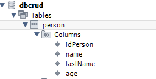

    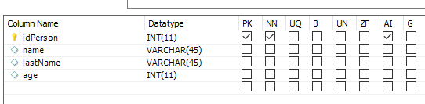

    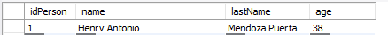

  * Ejecutamos la aplicacion.

    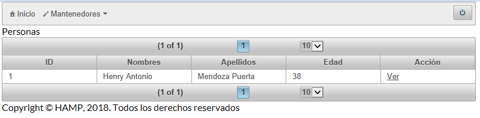

#### [Ir a Contenido](#content-id)
---    


